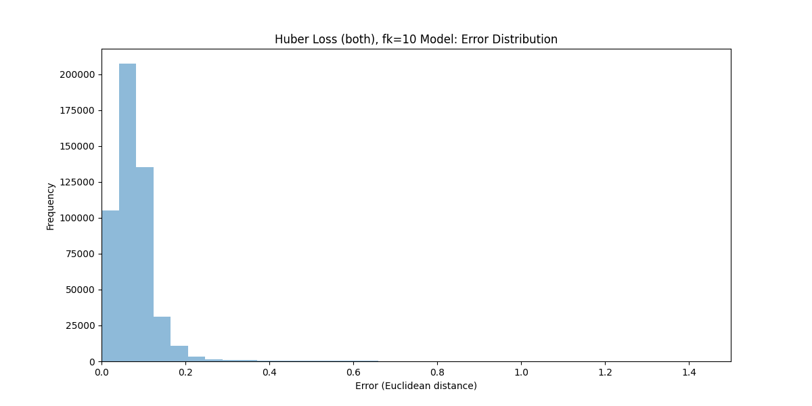
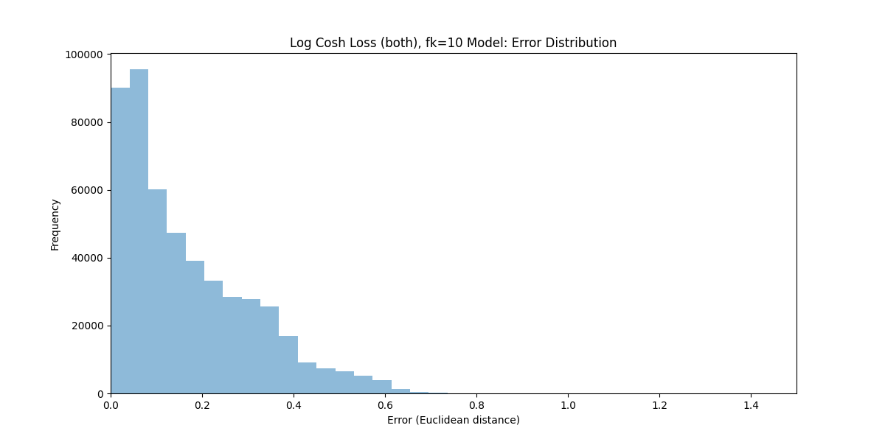

# Inverse Kinematics Neural Network

This project implements a neural network to solve the inverse kinematics problem for a 3-link robotic arm using TensorFlow and Keras. It compares different loss functions and includes visualization of the results.

## Project Overview

The main goal of this project is to train a neural network that can accurately predict the joint angles of a 3-link robotic arm given its end-effector position. The project includes:

- Data preprocessing and normalization
- Neural network model creation and training
- Custom loss functions implementation
- Model evaluation and error analysis
- Visualization of results

## Key Features

- Forward kinematics implementation using TensorFlow
- Custom loss function combining joint angle prediction and forward kinematics
- Huber loss implementation for robust training
- Learning rate scheduling with warmup and cosine decay
- MLflow integration for experiment tracking
- Visualization of error distributions and true vs predicted values

## Code Structure

- `forward_kinematics_tf()`: Implements forward kinematics using TensorFlow
- `evaluate_model()`: Evaluates the trained model on test data
- `custom_loss()`: Implements a custom loss function combining joint angle and forward kinematics losses
- `huber_loss()`: Implements the Huber loss function
- `create_model()`: Creates and compiles the neural network model
- `load_and_preprocess_data()`: Loads and preprocesses the dataset
- `train_and_evaluate_model()`: Trains the model and evaluates its performance
- `plot_error_distribution()`: Visualizes the error distribution
- `plot_true_vs_predicted()`: Visualizes true vs predicted values

## Results

Huber loss (for the joint loss) vs MSE loss

| Huber Loss (joint, fk=10) | Custom Loss (fk=10) |
|:-------------------------:|:-------------------:|
|  |  |

The results show that the Huber Loss model generally performs better, especially for larger errors. The error distribution for the Huber Loss model is more concentrated around zero compared to the Custom Loss model.

## Results

We compared two Huber Loss models: one applying Huber Loss to both forward kinematics (FK) and joint angles, and another applying it only to joint angles. Both models use fk=10. The error distribution graphs for both models are presented below, followed by a comparison table.

| Huber Loss (both FK and joint, fk=10) | Huber Loss (joint only, fk=10) |
|:-------------------------------------:|:------------------------------:|
|  |  |

The results show that applying Huber Loss to both forward kinematics and joint angles generally outperforms applying it to joint angles only. The model with Huber Loss applied to both components demonstrates a higher peak frequency, indicating more predictions with very low error. It also shows a more concentrated error distribution near zero and a narrower overall error range, suggesting more consistent and accurate predictions across various scenarios. The steeper decline in frequency for larger errors indicates better handling of potential outliers or more challenging cases.

| Log Cosh Loss (both, fk=10) | Custom Loss (fk=10) |
|:---------------------------:|:-------------------:|
|  |  |

### Log Cosh Loss (both, fk=10)

The Log Cosh Loss model, applied to both forward kinematics and joint angles, shows a concentrated error distribution near zero. This is better than the MSE but still worse than Huber. Huber is actually pretty decent!