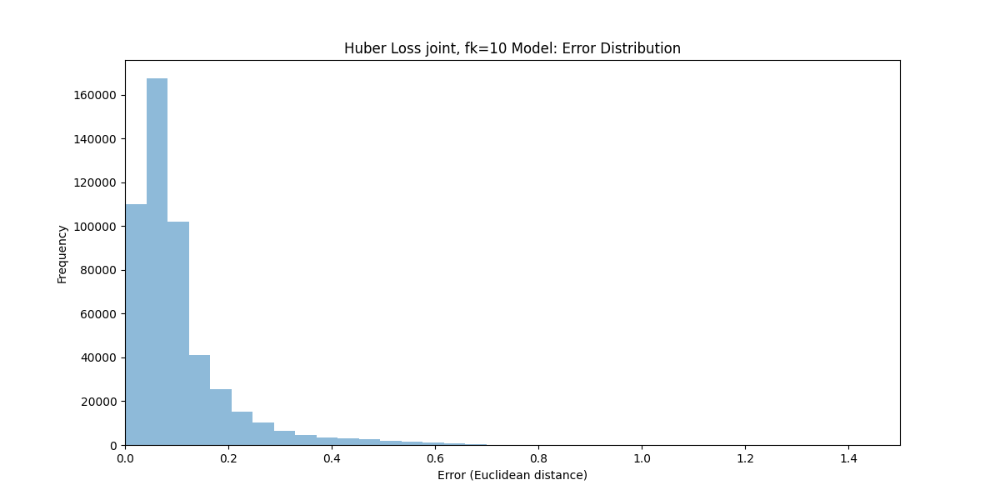
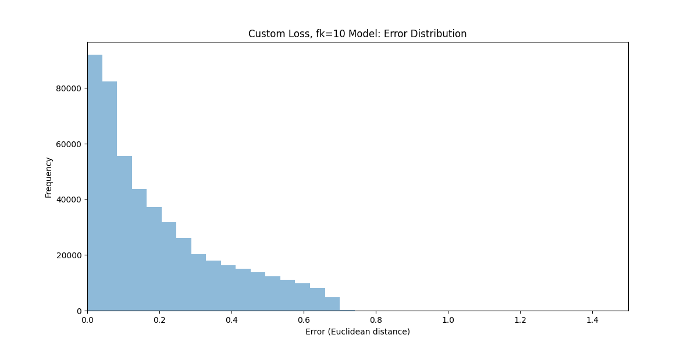

# Inverse Kinematics Neural Network

This project implements a neural network to solve the inverse kinematics problem for a 3-link robotic arm using TensorFlow and Keras. It compares different loss functions and includes visualization of the results.

## Project Overview

The main goal of this project is to train a neural network that can accurately predict the joint angles of a 3-link robotic arm given its end-effector position. The project includes:

- Data preprocessing and normalization
- Neural network model creation and training
- Custom loss functions implementation
- Model evaluation and error analysis
- Visualization of results

## Key Features

- Forward kinematics implementation using TensorFlow
- Custom loss function combining joint angle prediction and forward kinematics
- Huber loss implementation for robust training
- Learning rate scheduling with warmup and cosine decay
- MLflow integration for experiment tracking
- Visualization of error distributions and true vs predicted values

## Code Structure

- `forward_kinematics_tf()`: Implements forward kinematics using TensorFlow
- `evaluate_model()`: Evaluates the trained model on test data
- `custom_loss()`: Implements a custom loss function combining joint angle and forward kinematics losses
- `huber_loss()`: Implements the Huber loss function
- `create_model()`: Creates and compiles the neural network model
- `load_and_preprocess_data()`: Loads and preprocesses the dataset
- `train_and_evaluate_model()`: Trains the model and evaluates its performance
- `plot_error_distribution()`: Visualizes the error distribution
- `plot_true_vs_predicted()`: Visualizes true vs predicted values

## Results

Huber loss (for the joint loss) vs MSE loss

| Huber Loss (joint, fk=10) | Custom Loss (fk=10) |
|:-------------------------:|:-------------------:|
|  |  |

The results show that the Huber Loss model generally performs better, especially for larger errors. The error distribution for the Huber Loss model is more concentrated around zero compared to the Custom Loss model.
