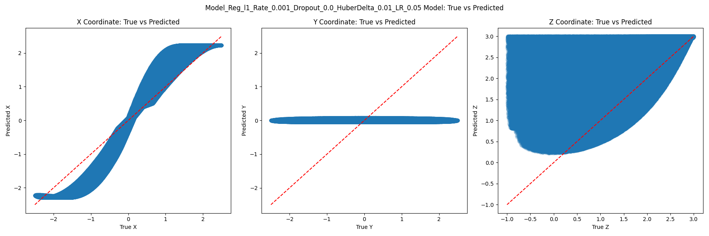
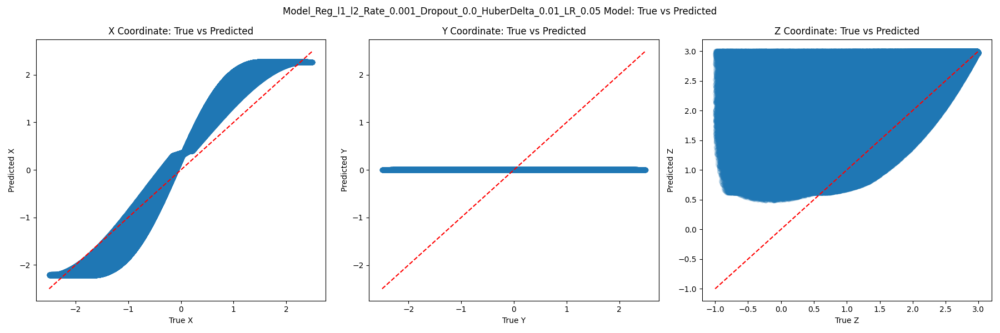

# Inverse Kinematics Neural Network

This project implements a neural network to solve the inverse kinematics problem for a 3-link robotic arm using TensorFlow and Keras. It compares different loss functions and includes visualization of the results.

## Project Overview

The main goal of this project is to train a neural network that can accurately predict the joint angles of a 3-link robotic arm given its end-effector position. The project includes:

- Data preprocessing and normalization
- Neural network model creation and training
- Custom loss functions implementation
- Model evaluation and error analysis
- Visualization of results

## Key Features

- Forward kinematics implementation using TensorFlow
- Custom loss function combining joint angle prediction and forward kinematics
- Huber loss implementation for robust training
- Learning rate scheduling with warmup and cosine decay
- MLflow integration for experiment tracking
- Visualization of error distributions and true vs predicted values

## Code Structure

- `forward_kinematics_tf()`: Implements forward kinematics using TensorFlow
- `evaluate_model()`: Evaluates the trained model on test data
- `custom_loss()`: Implements a custom loss function combining joint angle and forward kinematics losses
- `huber_loss()`: Implements the Huber loss function
- `create_model()`: Creates and compiles the neural network model
- `load_and_preprocess_data()`: Loads and preprocesses the dataset
- `train_and_evaluate_model()`: Trains the model and evaluates its performance
- `plot_error_distribution()`: Visualizes the error distribution
- `plot_true_vs_predicted()`: Visualizes true vs predicted values

## Results

Huber loss (for the joint loss) vs MSE loss

| Huber Loss (joint, fk=10) | Custom Loss (fk=10) |
|:-------------------------:|:-------------------:|
|  |  |

The results show that the Huber Loss model generally performs better, especially for larger errors. The error distribution for the Huber Loss model is more concentrated around zero compared to the Custom Loss model.

## Results

We compared two Huber Loss models: one applying Huber Loss to both forward kinematics (FK) and joint angles, and another applying it only to joint angles. Both models use fk=10. The error distribution graphs for both models are presented below, followed by a comparison table.

| Huber Loss (both FK and joint, fk=10) | Huber Loss (joint only, fk=10) |
|:-------------------------------------:|:------------------------------:|
|  |  |

The results show that applying Huber Loss to both forward kinematics and joint angles generally outperforms applying it to joint angles only. The model with Huber Loss applied to both components demonstrates a higher peak frequency, indicating more predictions with very low error. It also shows a more concentrated error distribution near zero and a narrower overall error range, suggesting more consistent and accurate predictions across various scenarios. The steeper decline in frequency for larger errors indicates better handling of potential outliers or more challenging cases.

| Log Cosh Loss (both, fk=10) | Custom Loss (fk=10) |
|:---------------------------:|:-------------------:|
|  |  |

### Log Cosh Loss (both, fk=10)

The Log Cosh Loss model, applied to both forward kinematics and joint angles, shows a concentrated error distribution near zero. This is better than the MSE but still worse than Huber. Huber is actually pretty decent!

After 50 epochs of training

Changing the delta value to 0.1 and the epochs to 100. Hopefully getting better results.

## Activation function result
MLFlow results for activation function investigation

We evaluated several models with different configurations. The table below summarizes their performance metrics:

| Model Name | Duration | 90th Percentile Error | Max Error | Mean Error | Median Error |
|------------|----------|----------------------|-----------|------------|--------------|
| Model_1_relu_relu_relu_relu_lr_0.01 | 1.3min | 0.04184273 | 3.64790892 | 0.02460836 | 0.02625200 |
| Model_3_swish_swish_swish_swish_lr_0.01 | 1.8min | 0.04270539 | 3.59251761 | 0.02516400 | 0.02395946 |
| Model_4_mish_mish_mish_mish_lr_0.04 | 2.0min | 0.04236185 | 3.65731143 | 0.02574110 | 0.02465255 |
| Model_3_swish_swish_swish_swish_lr_0.04 | 1.8min | 0.04324990 | 3.10410356 | 0.02605691 | 0.02532476 |
| Model_1_relu_relu_relu_relu_lr_0.04 | 1.3min | 0.04387920 | 0.92929136 | 0.02616043 | 0.02741017 |

### Analysis

1. **Training Time**: The ReLU models (Model_1) consistently show the fastest training times at 1.3 minutes, while the Mish model (Model_4) takes the longest at 2.0 minutes.

2. **Error Metrics**:
   - **90th Percentile Error**: All models perform similarly, with errors ranging from 0.0418 to 0.0439.
   - **Max Error**: Model_1 with lr_0.04 significantly outperforms others, having a max error of 0.929 compared to 3+ for other models.
   - **Mean Error**: Model_1 with lr_0.01 shows the lowest mean error (0.0246), while Model_3 with lr_0.04 has the highest (0.0261).
   - **Median Error**: Model_3 with lr_0.01 has the lowest median error (0.0240), while Model_1 with lr_0.04 has the highest (0.0274).

3. **Learning Rate Impact**: 
   - For Model_1 (ReLU), increasing the learning rate from 0.01 to 0.04 significantly reduced the max error but slightly increased other error metrics.
   - For Model_3 (Swish), the higher learning rate (0.04) resulted in slightly higher error metrics across the board.

4. **Activation Function Comparison**:
   - ReLU models show faster training times but mixed results in error metrics.
   - Swish models demonstrate good performance, particularly with the lower learning rate.
   - The Mish model shows competitive performance but with the longest training time.

Overall, the choice between these models depends on the specific requirements of the application. If training time is a priority, the ReLU models offer the best speed. For overall error minimization, the Swish model with lr_0.01 provides a good balance. If the goal is to minimize the worst-case scenario (max error), the ReLU model with lr_0.04 stands out significantly.

Result: Up until now, we know that ReLU is the best, LR between 0.01 to 0.04 is the best and also Cosine Learning Scheduler is the best too. Also I cannot emphasize how important HuberLoss is.

Next steps:
1. Architecture changes
2. BatchNorms to make it better
3. Gradient Clip
4. Regularization (Dropout, L1/L2)
5. HuberLoss Delta

### BatchNorm results

BatchNorm cannot compete with no batchnorm. It takes a LOT longer to train (2x or 3x). Also, to get the the same results, we need 3x or 4x more epochs!
So at least for this architecture, batchnorm is a no go!

## No reg, L1, L2, L1 and L2

#### High Regularization Rate
High LR

Low LR

#### Low Regularization Rate
High LR

Low LR

Regardless of low or high LR, regularization (any type) makes the results worse!

### Dropout

Dropout tends to make the results worse

### Huber Delta

So Huber delta can be pushes as low as 0.01 for better results

Next Steps:
1. Gradient Clipping
2. Exponential loss
3. Architecture change